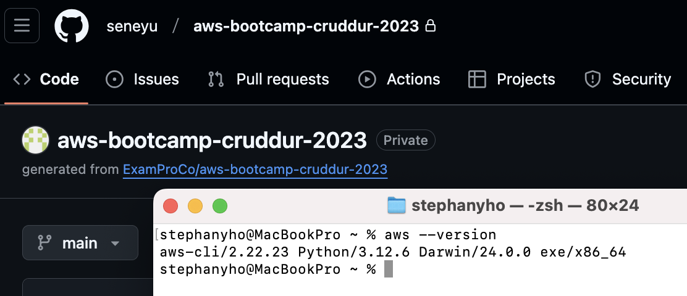
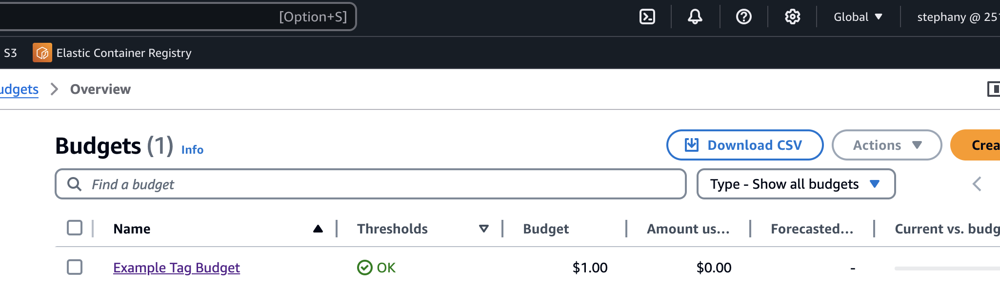
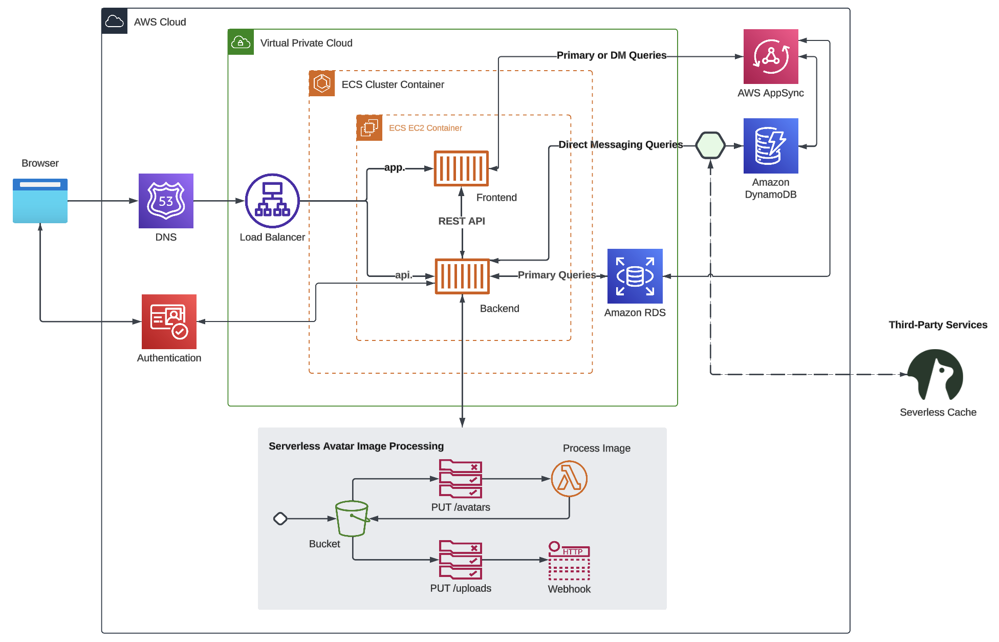

# Week 0 — Billing and Architecture

## Homework/Tasks

### Install and Verify AWS CLI

For Gitpod, I configured the installation in the `.gitpod.yml` file. This ensures that the AWS CLI is automatically installed whenever a new Gitpod workspace is launched.

I followed the instructions on the [AWS CLI Install Documentation Page](https://docs.aws.amazon.com/cli/latest/userguide/getting-started-install.html) and installed it on my local machine (macOS) as well:

```bash
curl "https://awscli.amazonaws.com/AWSCLIV2.pkg" -o "AWSCLIV2.pkg"
sudo installer -pkg AWSCLIV2.pkg -target /
```

After installation, I verified the installation using:

```bash
which aws
aws --version
aws sts get-caller-identity
```



### Create a Billing Alarm

#### Create SNS Topic

I created a SNS Topic with the following command:

```bash
aws sns create-topic --name billing-alarm
```

Using the returned TopicARN, I created a subscription supply the TopicARN and my email:

```bash
aws sns subscribe \
    --topic-arn TopicARN \
    --protocol email \
    --notification-endpoint your@email.com
```

I checked my email and confirmed the subscription.

#### Create Alarm

[AWS Cloudwatch put-metric-alarm](https://docs.aws.amazon.com/cli/latest/reference/cloudwatch/put-metric-alarm.html#examples)

[Create alarm via AWS CLI](https://repost.aws/knowledge-center/cloudwatch-estimatedcharges-alarm)

I updated the configuration json script with the TopicARN that I generated earlier.

```bash
aws cloudwatch put-metric-alarm --cli-input-json file://aws/json/alarm_config.json
```

### Create a Budget

[Create budget via AWS CLI](https://docs.aws.amazon.com/cli/latest/reference/budgets/create-budget.html)

I use the following command to create a budget.

```bash
aws budgets create-budget \
    --account-id AccountID \
    --budget file://aws/json/budget.json \
    --notifications-with-subscribers file://aws/json/notifications-with-subscribers.json
```

I created my own budget alarm for $1 as an example.


### Recreate Logical Architectual Diagram in Lucid Charts



[Lucid Chart Share Link](https://lucid.app/lucidchart/6a65cb83-2bb5-4072-8e29-74da691a8377/edit?viewport_loc=-1508%2C-187%2C1962%2C1148%2C0_0&invitationId=inv_3fcba3a6-4b10-4e70-aae0-4af36e604731)
