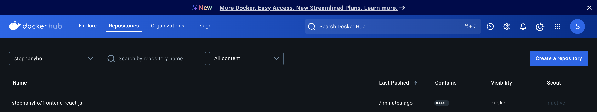
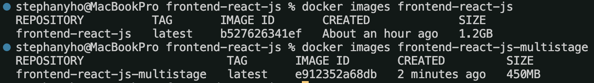

# Week 1 — App Containerization

## Add Dockerfiles

We created Dockerfiles for frontend and backend, and docker-compose.yml in root directory.

We also added DynamoDB Local and Postgres as containers and reference them externally.

We built and ran frontend and backend images, and used `docker compose up` to run multiple containers.

## Adding DynamoDB Local and Postgres

### Postgres

Add the following Postgres database service to `docker-compose.yml`:

```yaml
services:
  db:
    image: postgres:13-alpine
    restart: always
    environment:
      - POSTGRES_USER=postgres
      - POSTGRES_PASSWORD=password
    ports:
      - '5432:5432'
    volumes:
      - db:/var/lib/postgresql/data
volumes:
  db:
    driver: local
```

To install postgres client into Gitpod, I added below to `.gitpod.yml`.

```yaml
- name: postgres
  init: |
    curl -fsSL https://www.postgresql.org/media/keys/ACCC4CF8.asc|sudo gpg --dearmor -o /etc/apt/trusted.gpg.d/postgresql.gpg
    echo "deb http://apt.postgresql.org/pub/repos/apt/ `lsb_release -cs`-pgdg main" |sudo tee  /etc/apt/sources.list.d/pgdg.list
    sudo apt update
    sudo apt install -y postgresql-client-13 libpq-dev
```

### DynamoDB Local

Add the following DynamoDB Local service to `docker-compose.yml`:

```yaml
services:
  dynamodb-local:
    # https://stackoverflow.com/questions/67533058/persist-local-dynamodb-data-in-volumes-lack-permission-unable-to-open-databa
    # We needed to add user:root to get this working.
    user: root
    command: '-jar DynamoDBLocal.jar -sharedDb -dbPath ./data'
    image: 'amazon/dynamodb-local:latest'
    container_name: dynamodb-local
    ports:
      - '8000:8000'
    volumes:
      - './docker/dynamodb:/home/dynamodblocal/data'
    working_dir: /home/dynamodblocal
```

### Volumes

Directory volume mapping:

```yaml
volumes:
  - './docker/dynamodb:/home/dynamodblocal/data'
```

Named volume mapping:

```yaml
volumes:
  - db:/var/lib/postgresql/data

volumes:
  db:
    driver: local
```

### Connect to Postgres and DynamoDB Local Database

#### Postgres

I installed the [MySQL extension (officially the "Database Client")](https://marketplace.visualstudio.com/items?itemName=cweijan.vscode-mysql-client2) by Weijan Chen, which supports database management, including connecting to servers, and it is compatible with various database systems including Postgres.

After adding this extension to Gitpod workspace, the following line is automatically added in `gitpod.yml` under the extensions section:

```text
- cweijan.vscode-database-client2
```

I verified the connection with following command line along with password for user postgres - `password`.

```bash
psql -U postgres --host localhost
```

#### DynamoDB Local

I verified DynamoDB local connection with commands from repo [100DaysOfCloud/challenge-hynamodb-local](https://github.com/100DaysOfCloud/challenge-dynamodb-local).

## Homework/Tasks

### Push and tag an image to DockerHub

Using the frontend image as an example, I navigated to the frontend directory, built an image and named it `frontend-react-js` with the Dockerfile:

```bash
cd frontend-react-js
docker build -t frontend-react-js .
```

I logged in to DockerHub from terminal, tagged the image with my DockerHub username, and pushed the image to DockerHub:

```bash
docker login
docker tag frontend-react-js YOUR_USERNAME/frontend-react-js
docker push YOUR_USERNAME/frontend-react-js
```

**Note:** Consider using version tags (e.g., ':v1.0.0') for better image management.



### Use multi-stage building for a Dockerfile build

I updated the frontend Dockerfile with multi-stage building.

```yml
# Build stage
FROM node:16.18 AS base

WORKDIR /usr/src/app
COPY package*.json ./
RUN npm install
COPY . .
RUN npm run build

# Final stage
FROM node:16.18-alpine

WORKDIR /usr/src/app
COPY package*.json ./
RUN npm install --production

COPY --from=base /usr/src/app/build ./build

EXPOSE 3000
CMD ["npm", "start"]
```



With multistage builds, we can use multiple `FROM` statements in Dockerfile. Each `FROM` instruction starts a new build stage, and we can selectively copy artifacts from one stage to another.

There are multiple benefits of multistage builds. Multistage build images are smaller in size because final images contain only what is necessary to run the application. They are small in size and therefore result in faster deployments. There is a clean separation because build-time dependencies are separated from runtime.

Reference: [Dockerizing NodeJs Application with Multi-Stage Build](https://sachithsiriwardana.medium.com/dockerizing-nodejs-application-with-multi-stage-build-e30477ca572)

## Notes

### Docker Container Security Best Practices

- Keep Host and Docker updated to latest security patches
- Docker Daemon & containers should run in non-root user mode
- Image Vulnerability Scanning
- Trusting a private vs public image registry
- No sensitive data in Dockerfiles or images
- Use secret management services to share secrets
- Read-only filesystem and volume for Docker
- Separate databases for long term storage
- Use DevSecOps practices while building application security
- Ensure all code is tested for vulnerabilities before production use
